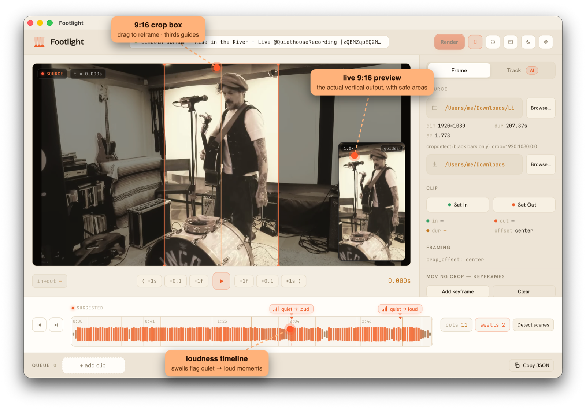

<p align="center">
  <picture>
    <source media="(prefers-color-scheme: dark)" srcset="icons/lockup-dark.svg">
    
  </picture>
</p>

<p align="center">
Turn 16:9 performance and music videos into clean <strong>1080×1920 (9:16) H.264 MP4</strong><br>
clips for Reels / TikTok / YouTube Shorts. <strong>Control-first</strong>: you pick the moment and the<br>
framing; Footlight nails the frame-accurate cut, crop, and export.
</p>

<p align="center">
  <a href="https://codecov.io/gh/tjbaker/footlight"></a>
  <a href="https://codecov.io/gh/tjbaker/footlight"></a>
</p>

## Philosophy — control-first, not auto-magic

Footlight automates the *mechanical* part of vertical clipping — **cut → crop →
scale → encode** — **after** a human has made the creative decisions: which
moment to clip and where to frame it. It does **not** try to pick moments for
you.

This is deliberate. Transcript-based auto-clippers (Opus Clip, Klap, and the
like) decide what to clip by reading speech, so they are built for talking-head
content and fall apart on instrumental and live-performance footage where there
is no transcript to key off. Footlight serves that underserved case: **music and
live performance**, where the editor already knows the moment and the subject
moves across the frame. You make the calls; Footlight does the rendering.

## Status

This is an early build. Footlight is a **TypeScript render engine + CLI** with a
**desktop GUI** (Tauri) for visual frame-accurate cutting and crop authoring —
including punch-in/zoom framing, optional **per-clip burned captions**, and
**optional AI-assisted subject tracking** (provider-agnostic, with Gemini as the
reference vision provider) as an opt-in accelerant, never a gate. See [SPEC.md](SPEC.md) for the design rationale; the
roadmap lives in [issues](https://github.com/tjbaker/footlight/issues) and
[releases](https://github.com/tjbaker/footlight/releases).

You **run it from source** — there is no prebuilt/signed download. The browser
GUI needs only Node; the native window additionally needs the Rust toolchain.
See **[Running Footlight](#running-footlight)** below.

## Requirements

- **`ffmpeg`** and **`ffprobe`** — Footlight invokes these to do all
  cut/crop/scale/encode work. **Burned captions** need an ffmpeg built with
  **libass** (the `subtitles` filter), which Homebrew's *core* `ffmpeg` does
  **not** include — on macOS install
  `brew install homebrew-ffmpeg/ffmpeg/ffmpeg`, which does. `make doctor` reports
  whether yours has it (verify with `ffmpeg -filters | grep -E 'ass|subtitles'`).
- **Node 26+**
- **Rust toolchain** (optional) — only for the *native* desktop window
  (`make tauri-dev`). Install via <https://rustup.rs>. The browser GUI and the
  CLI do not need it.

Footlight does **not** bundle ffmpeg/ffprobe/Node — it invokes whatever is on
your `PATH`. Run **`make doctor`** to verify your environment in one shot. On
**macOS**, **`make setup-system`** installs a libass-enabled ffmpeg (the
`homebrew-ffmpeg` tap, so burned captions work) via Homebrew; on other platforms,
`make doctor` prints the exact install command for anything missing.

## Getting started

From zero to your first vertical clip:

1. **Install the prerequisites** — `ffmpeg`, `ffprobe`, and Node 26+
   (see [Requirements](#requirements)). On **macOS**, `make setup-system`
   installs a libass-enabled ffmpeg via Homebrew.
2. **Set up and verify your environment:**
   ```bash
   make setup     # install all dependencies (root engine + GUI)
   make doctor    # verify Node 26+, ffmpeg, ffprobe are on PATH
   ```
3. **Launch the GUI in your browser** (no Rust needed):
   ```bash
   make gui
   ```
   This starts the dev backend (ffmpeg/ffprobe/CLI on :8787) and the Vite
   frontend together; open the printed localhost URL. Ctrl-C stops both.
4. **Cut your first clip:**
   - **Load** a source — Browse…, drag a video onto the window, or paste a path.
   - **Drag across the loudness timeline** to set In / Out.
   - **Frame** with the orange 9:16 box — drag to move, drag a corner to punch in.
   - **Add clip → queue**, choose a **Destination**, and **Render**.

Your clip lands in the Destination folder. Prefer a native window or the command
line? See **Running Footlight** and **CLI usage** below.

## Running Footlight

Everything is driven by `make` (run `make help` for the full list). The browser
GUI (`make gui`) is covered in **[Getting started](#getting-started)**; for a
native desktop window, with the Rust toolchain installed:

```bash
make tauri-dev     # native desktop window (hot-reloads)
make tauri-build   # build a local .app  (UNSIGNED — local use only)
```

> **No signed distribution.** `make tauri-build` produces an **unsigned** `.app`
> under `app/src-tauri/target/release/bundle/`. Build it on the Mac that will run
> it; to run it on another Mac, launch with **right-click → Open** (or clear the
> quarantine flag: `xattr -dr com.apple.quarantine /path/to/Footlight.app`). That
> machine still needs ffmpeg/ffprobe/Node on `PATH` — `make doctor` checks.

The CLI is also available directly after `make build` — see **CLI usage** below.

## The desktop app

`make gui` (browser) or `make tauri-dev` (native) opens a frame-accurate cutter:

<p align="center">
  <picture>
    <source media="(prefers-color-scheme: dark)" srcset="docs/images/footlight-dark-annotated.png">
    
  </picture>
</p>

- **Load** a source — Browse…, drag a video onto the window, or paste a path.
- **Loudness timeline** is the scrubber/trimmer: **drag across it to set In/Out**,
  click to seek, hover to preview frames. It draws volume over time with suggested
  quiet→loud **swells**, plus scene-cut ticks and ⏮ / ⏭ cut-jumps (scenes are
  auto-detected on load).
- **Beat snap (optional):** detected audio onsets — drum hits, note attacks —
  show as subtle ticks along the bottom of the timeline. Turn on **Snap** and a
  released In/Out drag (or pressing **I / O**) magnetizes the point to the
  nearest onset within ±150 ms, so cuts land on the musical phrase. Off by
  default and applied only at release — your points never move behind your back.
- **Frame** with the orange 9:16 box — drag to reposition, drag a **corner to
  punch in / zoom**, double-click to reset. A live **9:16 output preview** (with
  optional social safe-area guides) shows the actual vertical result as you frame.
- **Moving crop:** drop **keyframes** for a time-keyed schedule that hard-switches
  the crop at cuts.
- **Auto-track** (optional, BYOK): AI subject tracking builds a smooth eased crop
  path across one shot — a reviewable suggestion. Add a Gemini key in **Settings**
  (stored in your OS keychain), or set **`GEMINI_API_KEY`** in your environment /
  `.env` — the env var works for the CLI and `make gui` and takes precedence over a
  stored key (see `.env.example`). AI is entirely optional; the core never needs a key.
- **Captions (optional)** — give a clip a burned-in **hook + title**, styled
  **per clip** right next to the text with a live preview: font (your system fonts
  or a custom fonts folder), fill / outline color, bold / italic / underline,
  shadow, box, rotation, and 9-zone placement. Off by default — a clean export
  stays the default (see [Captions](#captions-optional)).
- **Add clip → queue** (editable: click a card to re-edit, drag to reorder,
  duplicate), choose a **Destination**, and **Render**. Past renders are saved to
  **History** for one-click re-framing; your working session is autosaved and
  restored on next launch. **Export** the queue as a JSON manifest (it re-imports
  via `footlight render`); **Export cover** saves the current frame — through the
  active framing, exactly as the render would crop it — as a 1080×1920 PNG ready
  to upload as the post's cover image; **Clear** resets the workspace to start fresh.
- **Keyboard-driven** (NLE-style) — Space to play, **J / K / L** to shuttle
  (reverse / pause / forward, tap again to speed up), ← / → to step a frame,
  **I / O** to mark In / Out (**Shift+I / O** or **Q / W** to jump to them),
  **↑ / ↓** (or **[ / ]**) for scene cuts, **S** to queue, and more; press **?**
  for the shortcuts overlay.

In-app **Help → User Guide** documents all of this.

## CLI usage

```bash
# Render every clip described in a manifest (CSV or JSON).
footlight render manifest.csv|.json [--outdir clips] [--crf 19] [--preset medium] \
                                    [--audio-bitrate copy] [--dry-run] \
                                    [--burn-captions [--caption-font <path|name>] \
                                      [--caption-color #RRGGBB] [--caption-outline-color #RRGGBB] \
                                      [--caption-bold] [--caption-italic] [--caption-underline] \
                                      [--caption-shadow] [--caption-box [--caption-box-color #RRGGBB]] \
                                      [--caption-angle <deg>]]

# Inspect a source: dimensions + a cropdetect suggestion (black bars only).
footlight probe <source>

# List detected scene-cut timestamps (to seed crop-schedule switch points).
footlight scenes <source>
```

### `render` flags

| flag | default | meaning |
|------|---------|---------|
| `--outdir` | `clips` | output directory for rendered clips |
| `--crf` | `19` | H.264 quality; lower = better / larger |
| `--preset` | `medium` | x264 speed/efficiency preset |
| `--audio-bitrate` | `copy` | `copy` passes the source audio through losslessly (no re-encode, no resample); pass an AAC bitrate like `256k` only to force a re-encode |
| `--dry-run` | off | print the `ffmpeg` commands without running them |
| `--burn-captions` | off | burn each clip's `hook` / `title` into the video (clips export clean by default — see [Captions](#captions-optional)) |
| `--caption-font` | system sans | caption font: a `.ttf` / `.otf` file path **or** a fontconfig family name (only with `--burn-captions`) |
| `--caption-color` | `#FFFFFF` | caption fill color, `#RRGGBB` (only with `--burn-captions`) |
| `--caption-outline-color` | `#000000` | caption outline color, `#RRGGBB` (only with `--burn-captions`) |
| `--caption-bold` | off | render captions **bold** (only with `--burn-captions`) |
| `--caption-italic` | off | render captions *italic* (only with `--burn-captions`) |
| `--caption-underline` | off | underline captions (only with `--burn-captions`) |
| `--caption-shadow` | off | drop a shadow behind the caption text (only with `--burn-captions`) |
| `--caption-box` | off | draw an opaque box behind the caption text (only with `--burn-captions`) |
| `--caption-box-color` | `#000000` | box fill color, `#RRGGBB` (only with `--caption-box`) |
| `--caption-angle` | `0` | rotate the caption by N degrees (only with `--burn-captions`) |

The `--caption-*` flags are **render-wide defaults**. A JSON clip can carry its own
[`caption` object](#captions-optional) whose fields override these per clip; the flag
still applies to every clip that doesn't set that field. `--burn-captions` remains the
render-wide on/off switch.

`probe` reports the source's dimensions and a `cropdetect` content-region
suggestion. `scenes` reports detected cut timestamps you can use as switch points
in a time-keyed `crop_offset` schedule.

## CSV schema

The manifest is the source of truth: **one row per clip.**

| column | required | meaning |
|--------|----------|---------|
| `source_file` | yes | path to the source video |
| `in_point` | yes | start timestamp — `HH:MM:SS`, `MM:SS`, or seconds |
| `out_point` | yes | end timestamp — same formats |
| `fade_in` | optional | fade the clip in from black (and its audio up from silence) over this many seconds |
| `fade_out` | optional | fade the clip out to black (and its audio down to silence) over this many seconds |
| `crop_offset` | defaults `center` | horizontal framing: `left` / `center` / `right`, an integer x-pixel offset (from the left edge, clamped into frame), **or** a time-keyed schedule like `0=center; 14.5=440` |
| `content_crop` | optional | `W:H:X:Y` region cropped *first* to strip letterbox/pillarbox bars; crop offsets then become relative to it |
| `out_name` | optional | output filename; auto-generated from source + timestamps if blank |
| `hook` | optional | caption: the big headline line (see [Captions](#captions-optional)) |
| `title` | optional | caption: the secondary line below the hook |
| `text_position` | defaults `bottom` | caption placement, one of 9 zones: a vertical keyword `top` / `center` / `bottom`, optionally suffixed `-left` / `-center` / `-right` (e.g. `bottom-left`, `top-right`); plain `top` / `center` / `bottom` stay horizontally centered |

The `hook` / `title` / `text_position` fields carry your caption shot-list with the
manifest. Clips export **clean by default** — these are only burned in when you pass
`--burn-captions`. See **[Captions](#captions-optional)**.

**Fades.** `fade_in` / `fade_out` fade the video from/to black and the audio
from/to silence over the given seconds (burned captions fade with the picture —
the fades run last in the filter chain). Reels/TikTok loop, so a short fade pair
reads as a finished clip. Two rules to know: the fades together must fit inside
the clip (`fade_in + fade_out ≤ out − in`, checked before rendering), and **a
fade forces that clip's audio to re-encode** (AAC 256k) when the render is set to
the default lossless `--audio-bitrate copy` — an `afade` can't ride a stream
copy, and a video fade over a hard audio cut reads as broken. The CLI logs a note
on each clip this applies to. In the GUI, use the **Loop seam** toggle next to
the In/Out readout to see the clip's last and first frames side by side and trim
to a clean loop.

**JSON manifests.** Pass a `.json` array of the same clip objects instead of a CSV
to use fields CSV can't express: **`cropWindow`** (an explicit 9:16
punch-in/zoom window), **`cropPath`** (an eased subject-tracking crop path), and a
per-clip **`caption`** style object (see [Captions](#captions-optional)).
The GUI writes these for you; render precedence is `cropPath` → `cropWindow` →
`crop_offset`.

### Why `crop_offset` is per-clip

A one-man-band moves across the frame between instruments, so a fixed center crop
cuts off the action. Each clip sets its own horizontal framing. `left` /
`center` / `right` cover most cases; a numeric x-pixel offset gives fine control
between them.

For **edited / multi-shot sources** (a music video that cuts between angles),
give `crop_offset` a **time-keyed schedule** like `0=center; 14.5=440`. The crop
x **hard-switches** at each clip-relative time. Align those switch times to the
source's own cuts (use `footlight scenes`) and the change is invisible. For clips
with heavy continuous movement *within a single shot*, Footlight's optional
**auto-track** (AI, opt-in, BYOK) builds a smooth eased crop path that follows the
subject — a reviewable suggestion you edit before rendering (see
[SPEC.md](SPEC.md) §6.9).

## Captions (optional)

Clips export **clean — no burned-in text — by default.** Captions are **opt-in**.

The intent is to keep your headline text *native*: typed into Reels / TikTok /
Shorts where each platform renders it, so it stays editable and dodges the ranking
penalty those platforms apply to non-native, baked-in text. Burn captions only when
you specifically need them in the pixels (a download, a cross-post, a platform
without a text tool).

You still describe captions per clip in the manifest, so the shot-list travels with
the cut even when nothing is burned:

| field | meaning |
|-------|---------|
| `hook` | the big headline line |
| `title` | the secondary line, set below the hook |
| `text_position` | one of 9 zones — `top` / `center` / `bottom`, optionally `-left` / `-center` / `-right` (default `bottom`, horizontally centered) |

Both text fields are **multiline**: a newline in the field becomes a line break in
the burned caption, with every line rendered at that field's size. In the GUI just
press Enter; in a CSV manifest wrap the field in double quotes and break the line
inside them (standard CSV quoting); in JSON use `\n`. There is no auto-wrap — line
breaks are yours to place, so check long lines against the 1080 px frame.

To actually burn them into the video, add `--burn-captions` at render time:

```bash
# Clean clips (default) — manifest carries hook/title as a shot-list, nothing burned.
footlight render manifest.csv

# Burn the captions in, using the system default sans-serif.
footlight render manifest.csv --burn-captions

# Burn with your own font — a .ttf/.otf file path…
footlight render manifest.csv --burn-captions --caption-font ./fonts/Inter-Bold.ttf

# …or a fontconfig family name already installed on the system.
footlight render manifest.csv --burn-captions --caption-font "Helvetica Neue"

# Style the burned text — fill/outline color (#RRGGBB) and bold/italic/underline.
footlight render manifest.csv --burn-captions \
  --caption-color "#FFE600" --caption-outline-color "#101010" --caption-bold

# Add a drop shadow, an opaque box behind the text, and a slight rotation.
footlight render manifest.csv --burn-captions \
  --caption-shadow --caption-box --caption-box-color "#101010" --caption-angle -4
```

**Per-clip style (JSON manifests).** The `--caption-*` flags above set render-wide
defaults. A JSON clip can carry its own `caption` object to style that one clip; each
field overrides the matching flag (and the field falls back to the flag, then the
engine default, when omitted). `--burn-captions` is still the render-wide on/off
switch — a `caption` object only changes a clip's *style*, not whether text is burned.
All fields are optional:

```json
{
  "source_file": "show.mp4",
  "in_point": "1:02:10",
  "out_point": "1:02:38",
  "hook": "ENCORE",
  "title": "second set",
  "text_position": "bottom-left",
  "caption": {
    "font": "Impact",
    "color": "#FFCC00",
    "outlineColor": "#000000",
    "bold": true,
    "italic": false,
    "underline": true,
    "shadow": true,
    "box": true,
    "boxColor": "#202020",
    "angle": 12
  }
}
```

| field | meaning |
|-------|---------|
| `font` | a system family **name** *or* a `.ttf` / `.otf` / `.ttc` file **path**; resolved on its own (a path → its real family via `fc-scan`, loaded as a `libass` `fontsdir`; a name → a fontconfig family) and fully replaces the render-wide font |
| `color` | fill color `#RRGGBB` (default white) |
| `outlineColor` | outline color `#RRGGBB` (default black) |
| `bold` / `italic` / `underline` | text style toggles |
| `shadow` | drop shadow behind the text |
| `box` | opaque box behind the text |
| `boxColor` | box fill color `#RRGGBB` |
| `angle` | rotation in degrees |

Per-clip *style* is JSON-only. CSV manifests still carry caption **text** and
**position** (`hook` / `title` / `text_position`) but not the `caption` object — those
clips use the render-wide `--caption-*` defaults.

**Bring your own font.** Captions are bring-your-own-font and **local-first** —
Footlight bundles **no** caption font and never downloads one. The right caption
type is a creative choice, not a one-size-fits-all default. `--caption-font` takes
either a `.ttf` / `.otf` **file path** or a **fontconfig family name**: a path uses
that exact font file (Footlight resolves its real family name so `libass` renders it
correctly), while a name picks an installed family. With `--burn-captions` and no
`--caption-font`, the system default sans is used, which requires an `ffmpeg` built
**with fontconfig**.

**Choosing a font in the app.** The per-clip caption controls live in the editor,
next to the caption text and preview. Their font picker offers three ways to choose,
all local — nothing is fetched:

- **System fonts** — any font installed on your machine. Footlight enumerates them
  automatically and lists them under a *System fonts* group.
- **Fonts folder** — point Footlight at a directory of your own `.ttf` / `.otf` /
  `.ttc` files (set once under **Settings → Rendering → Captions** — Browse on the
  desktop app, or type the path on the browser build). Those show up in a *Your fonts*
  group pinned to the top of every clip's picker for quick access — drop a font in the
  folder and it appears.
- **Custom path…** — the escape hatch for a single one-off font file.

**Style.** Captions render `hook` above `title` as one block, placed at the clip's
`text_position`, with the hook at roughly `h/18` and the title at `h/26` of the
1080×1920 output, inset by ~12% safe margins. The burned text (via the `libass`
renderer) can be styled either per clip (the JSON `caption` object) or render-wide
(the matching `--caption-*` flag, which the per-clip field overrides):

- **Fill color** and **outline color** as `#RRGGBB` — `caption.color` /
  `caption.outlineColor` (flags `--caption-color` / `--caption-outline-color`).
- **Bold**, **italic**, **underline** — `caption.bold` / `caption.italic` /
  `caption.underline` (flags `--caption-bold` / `--caption-italic` /
  `--caption-underline`).
- **Drop shadow** behind the text — `caption.shadow` (flag `--caption-shadow`).
- **Opaque box** behind the text, with its own `#RRGGBB` color — `caption.box` /
  `caption.boxColor` (flags `--caption-box` / `--caption-box-color`, box defaults to
  black). A box replaces the outline.
- **Rotation** by N degrees — `caption.angle` (flag `--caption-angle`).
- **Font** — `caption.font` (flag `--caption-font`).
- **Position** — the per-clip `text_position` field (9 zones; see the schema above).

In the app, all of this is **per-clip**, set in the editor's Captions group next to
the caption text and preview: a font picker, two color inputs, B / I / U toggles,
shadow/box toggles, a box-color input, a rotation control, and the position picker.
Only the **custom fonts folder** and the **burn-captions** toggle stay under
**Settings → Rendering → Captions** (the fonts folder feeds every clip's font
picker). Defaults are unchanged — white fill, black outline, no bold/italic/underline,
no shadow, no box, no rotation, `bottom` center — so existing manifests render exactly
as before.

## Audio

Audio is **copied losslessly by default** (`-c:a copy`): the source track is
passed through untouched — same codec, bitrate, and sample rate — so the encode
never adds a compression generation or resamples. **The source is the quality
ceiling** (YouTube tops out around 128k AAC / 140k Opus); re-encoding to a higher
bitrate would only pad it. Pass `--audio-bitrate 256k` only when you genuinely
need a re-encode (e.g. a frame-exact audio cut on a downbeat).

## Framing gotchas

> **`cropdetect` sees black bars only.** Colored or blurred-banner pillarboxing
> is invisible to it — a source can look full-frame to `footlight probe` while the
> real performance sits in a narrower center region with decorative side banners.
> A `left` / `right` crop relative to the full frame will then land on dead bars.

The framing call is **human**. Verify on the actual frames:

- For pillarboxed sources, use `center` (or a numeric `crop_offset` bounded to the
  content region), and/or set `content_crop` to the real content region so offsets
  become relative to it.
- Don't trust title/resolution/view-count metadata to judge usable footage — it
  cannot see the pixels.

To pre-screen a downloaded file's content bounds (black bars only):

```bash
ffmpeg -ss 60 -i FILE -vf cropdetect=limit=24:round=2 -frames:v 300 -f null -
```

…then read the suggested `crop=` value. `footlight probe` surfaces the same
suggestion.

## Contributing

Contributions are welcome — and not only code. Footlight has **two contribution
surfaces**: the render engine / CLI / GUI, and the **"framing brain"**
(`prompts/base.md`) — the prose that encodes framing domain knowledge. A newly
discovered pillarbox trap or a crop recipe for a new source type makes a valuable
prose-only PR, no code required. See **[CONTRIBUTING.md](CONTRIBUTING.md)**.

## Bugs & feedback

Found a bug or have a request? Please
[open an issue](https://github.com/tjbaker/footlight/issues/new/choose).
Repository: <https://github.com/tjbaker/footlight>. The desktop app's
**Help → Report a Bug** menu links to the same place.

## License

Footlight is licensed under the **Apache License 2.0** — see [LICENSE](LICENSE).

Footlight invokes `ffmpeg` / `ffprobe` as **separately installed** external
tools — it does **not** bundle them — so their **LGPL / GPL** terms apply to your
own install, not to Footlight, and Footlight's source stays Apache-2.0. (If you
ever do bundle ffmpeg binaries into a distributed build, you must then ship
ffmpeg's own license/notices and, for a GPL build, a source offer — see
[NOTICE](NOTICE).)
